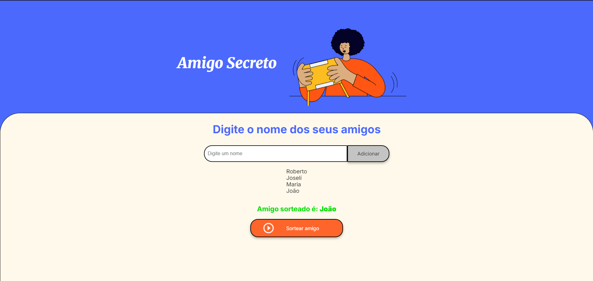

# 🎁 Sorteio de Amigo Secreto

[](https://github.com/MHSilvaDev/Challenge-Amigo-Secreto/stargazers)
[](https://github.com/MHSilvaDev/Challenge-Amigo-Secreto/network)
[](https://github.com/MHSilvaDev/Challenge-Amigo-Secreto/issues)

🔗 [Acesse o projeto online](https://MHSilvaDev.github.io/Challenge-Amigo-Secreto/)

Este é um projeto simples e divertido de **Sorteio de Amigo Secreto**, desenvolvido com **HTML**, **CSS** e **JavaScript puro**, ideal para praticar lógica de programação, manipulação do DOM e interações com o usuário.

---

## ✨ Funcionalidades

- Adição de participantes via input de texto.
- Lista dinâmica dos nomes adicionados.
- Sorteio aleatório de um participante.
- Prevenção de nomes duplicados.
- Validação de campos e quantidade mínima de participantes.

---

## 📷 Preview



---

## 🚀 Como usar

1. Clone o repositório:

```bash
git clone https://github.com/MHSilvaDev/Challenge-Amigo-Secreto.git
```

2. Navegue até o diretório do projeto e abra o arquivo `index.html` em seu navegador.

3. Digite o nome dos participantes e clique em **Adicionar** ou pressione **Enter**.

4. Após adicionar ao menos 3 participantes, clique em **Sortear** para descobrir o amigo secreto da vez!

---

## 🧠 Lógica JavaScript (resumo)

- Os nomes são armazenados em um array chamado `amigos`.
- O botão "Adicionar" adiciona nomes à lista e atualiza o HTML.
- O botão "Sortear" escolhe um nome aleatório (desde que haja pelo menos 3 participantes).
- Previne nomes duplicados e entradas vazias.

---

## 🛠️ Tecnologias

- 
- 
- 
---

## 📚 Aprendizados

Este projeto foi feito para praticar:

- Manipulação do DOM com JavaScript puro
- Eventos como `click` e `keypress`
- Uso de arrays e validações simples
- Interatividade em páginas web

---

## 🤝 Contribuições

Sinta-se à vontade para clonar, modificar e sugerir melhorias! Toda contribuição é bem-vinda. 💡

## ✒️ Autor

Desenvolvido por **MHSilvaDev**.

[](https://www.linkedin.com/in/mhsilvadev/)
[](https://github.com/MHSilvaDev)
[](https://discord.com/channels/@MHSilvaDev/)

---
